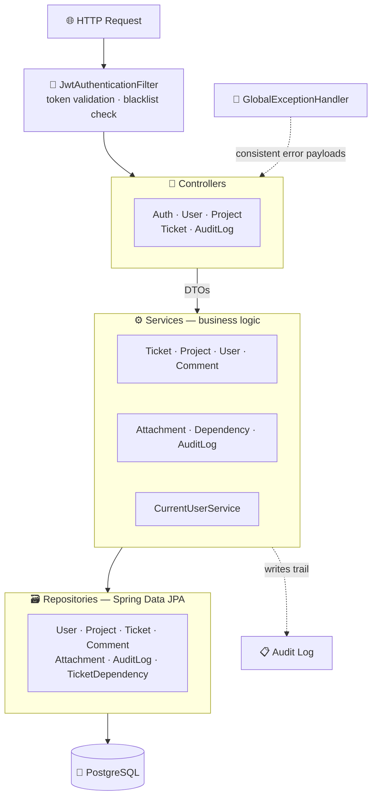

<div align="center">


<p>
  
  
  
  
  
  
</p>

<p>
  
  
  
  
</p>

</div>

---

## 📖 Overview

**IssueFlow** is a backend **issue-tracking REST API** — think a compact Jira: projects contain
tickets, tickets move through a lifecycle, carry comments, attachments and dependencies, and
every meaningful change is written to an audit trail.

It is built as a **layered Spring Boot application** with JWT-secured endpoints, a normalized
PostgreSQL schema, and a set of automated behaviours — workload-based assignment, overdue
escalation, soft deletion — that run without user intervention.

---

## 🏗️ Architecture



The codebase separates concerns strictly:

| Layer | Package | Responsibility |
|---|---|---|
| **Controller** | `controller/` | HTTP routing, request/response mapping |
| **DTO** | `dto/` | Request and response contracts — entities are never exposed directly |
| **Service** | `service/` | Business rules, validation, orchestration |
| **Repository** | `repository/` | Data access via Spring Data JPA |
| **Model** | `model/` | JPA entities and domain enums |
| **Security** | `security/` | JWT issuing, filtering, blacklisting, security config |
| **Exception** | `exception/` | Typed exceptions + centralized handler |

---

## ✨ Features

### Core

| Feature | Detail |
|---|---|
| 👤 **User management** | Create, update and query users with role-based access |
| 📁 **Project management** | Full CRUD with ownership |
| 🎫 **Ticket management** | CRUD with status, priority, type, assignee and due dates |
| 💬 **Comments** | Threaded discussion on tickets, with editing |
| 🔐 **JWT authentication** | Login, logout, token validation, current-user lookup |

### Extended

| Feature | Detail |
|---|---|
| 📋 **Audit logging** | Every action recorded with actor (`USER` / `SYSTEM`) and action type |
| 🔗 **Ticket dependencies** | Model blocking relationships between tickets |
| 📎 **Attachments** | `image/png`, `image/jpeg`, `application/pdf`, `text/plain` — max **10 MB** |
| 📤 **CSV export** | `GET /tickets/export?projectId=1` |
| 📥 **CSV import** | `POST /tickets/import` — multipart `projectId` + `file`, returns an import summary |
| 🗑️ **Soft delete + restore** | Deleted records are hidden from standard responses but recoverable |
| 🏷️ **Comment mentions** | Mention users in comments, with a paged mentions view |
| ⚖️ **Automatic assignment** | Omit `assigneeId` and the **least-loaded developer** is assigned |
| ⏫ **Automatic escalation** | Overdue tickets have their priority raised via `Priority.next()` |
| 📊 **Workload endpoint** | `GET /projects/{id}/workload` — per-developer load for a project |

---

## 📐 Domain Model

<div align="center">

| Enum | Values |
|---|---|
| **`TicketStatus`** | `TODO` → `IN_PROGRESS` → `IN_REVIEW` → `DONE` |
| **`Priority`** | `LOW` → `MEDIUM` → `HIGH` → `CRITICAL` *(with `next()` for escalation)* |
| **`TicketType`** | `BUG` · `FEATURE` · `TECHNICAL` |
| **`Role`** | `ADMIN` · `DEVELOPER` |
| **`AuditActor`** | `USER` · `SYSTEM` |
| **`AuditAction`** | `CREATE` `UPDATE` `DELETE` `RESTORE` `LOGIN` `LOGOUT` `AUTO_ASSIGN` `AUTO_ESCALATE` `ADD_DEPENDENCY` `REMOVE_DEPENDENCY` `IMPORT` `EXPORT` `UPLOAD_ATTACHMENT` `DELETE_ATTACHMENT` |

</div>

**Entities:** `UserEntity` · `ProjectEntity` · `TicketEntity` · `CommentEntity` ·
`AttachmentEntity` · `AuditLogEntity` · `TicketDependencyEntity`

---

## 📜 Business Rules

- **Lifecycle enforcement** — only valid `TicketStatus` transitions are accepted
- **Terminal state** — tickets can no longer be updated once they reach `DONE`
- **Optimistic locking** — concurrent edits to the same ticket are detected and rejected rather
  than silently overwriting each other
- **Role validation** — actions are checked against the caller's `Role`
- **Input validation** — request DTOs are validated via `spring-boot-starter-validation`
- **Consistent errors** — `GlobalExceptionHandler` turns `NotFoundException` and
  `BadRequestException` into uniform JSON error responses

---

## 🚀 Getting Started

### Prerequisites

| Requirement | Version |
|---|---|
| Java | **21+** |
| Docker | Docker Desktop / Compose |
| Maven | Wrapper included (`mvnw` / `mvnw.cmd`) |

### 1. Start PostgreSQL

```bash
docker compose up -d
```

Database is exposed on `localhost:5432` — database `issueflow`, user `issueflow`.

### 2. Build

```bash
./mvnw clean package
```

<sub>Windows: <code>.\mvnw.cmd clean package</code></sub>

### 3. Run

```bash
./mvnw spring-boot:run
```

The API starts on **`http://localhost:8080`**.

### 4. Authenticate

Create the first user — `password` is optional and defaults to `secret`:

```bash
curl -X POST http://localhost:8080/users \
  -H "Content-Type: application/json" \
  -d '{"username":"admin","email":"admin@example.com","fullName":"Admin User","role":"ADMIN","password":"secret"}'
```

Log in and copy the returned `accessToken`:

```bash
curl -X POST http://localhost:8080/auth/login \
  -H "Content-Type: application/json" \
  -d '{"username":"admin","password":"secret"}'
```

Call a protected endpoint:

```bash
curl http://localhost:8080/auth/me \
  -H "Authorization: Bearer YOUR_TOKEN_HERE"
```

### 5. Example flow

```bash
# Create a project
curl -X POST http://localhost:8080/projects \
  -H "Authorization: Bearer YOUR_TOKEN_HERE" \
  -H "Content-Type: application/json" \
  -d '{"name":"Sample Project","description":"Demo project","ownerId":1}'

# Create a ticket — omitting assigneeId auto-assigns the least-loaded developer
curl -X POST http://localhost:8080/tickets \
  -H "Authorization: Bearer YOUR_TOKEN_HERE" \
  -H "Content-Type: application/json" \
  -d '{"title":"Fix login bug","description":"Login fails sometimes","status":"TODO","priority":"HIGH","type":"BUG","projectId":1}'

# Inspect developer workload
curl http://localhost:8080/projects/1/workload \
  -H "Authorization: Bearer YOUR_TOKEN_HERE"
```

> 📄 Full endpoint reference and additional flows are documented in **[`run.md`](run.md)**.

---

## 🧪 Testing

```bash
./mvnw test
```

Tests run against an in-memory **H2** database, so no Docker container is needed for the suite.

| Test class | Scope |
|---|---|
| `IssueFlowApplicationTests` | Spring context loads correctly |
| `IssueFlowApiTests` | API behaviour across the main flows |

---

## 🛠️ Tech Stack

<div align="center">

| Category | Technology |
|---|---|
| **Language** | Java 21 |
| **Framework** | Spring Boot 3.4.2 |
| **Web** | `spring-boot-starter-web` |
| **Persistence** | Spring Data JPA · Hibernate |
| **Database** | PostgreSQL (runtime) · H2 (tests) |
| **Security** | Spring Security · JWT bearer tokens · token blacklist |
| **Validation** | `spring-boot-starter-validation` |
| **CSV** | Apache Commons CSV 1.10.0 |
| **Boilerplate** | Lombok |
| **Build** | Maven (wrapper included) |
| **Infrastructure** | Docker Compose |

</div>

---

## 📂 Repository Contents

| Path | Description |
|---|---|
| `src/main/java/` | Application source — controllers, services, repositories, entities, security |
| `src/main/resources/` | `application.yaml`, `schema.sql`, `data.sql` |
| `src/test/java/` | JUnit test suites |
| [`run.md`](run.md) | Setup, build, run and full API usage guide |
| [`prompts.md`](prompts.md) | AI usage log and responsibility statement for the assignment |
| `compose.yml` | PostgreSQL service definition |
| `pom.xml` | Maven build and dependencies |

---

## 👤 Author

**Wadiea Farran**
Software Engineering — Braude College of Engineering

<a href="https://github.com/wadiea1">
  
</a>

---

<div align="center">
</div>
